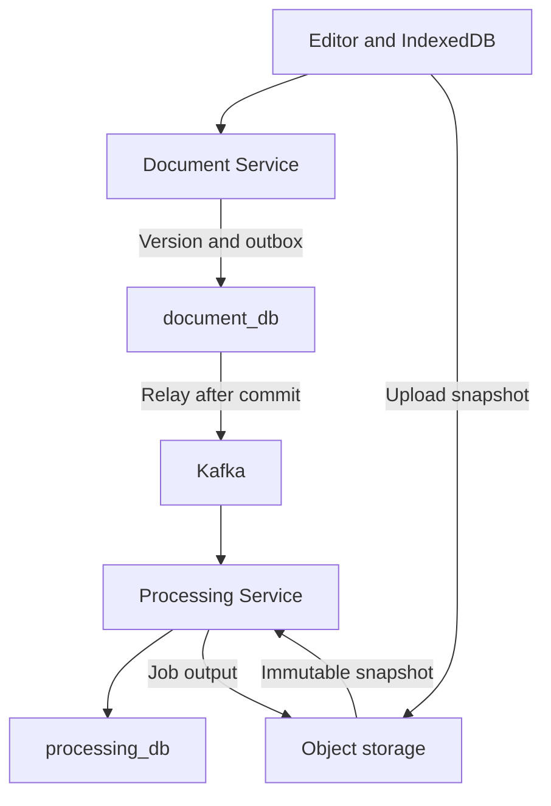

# Architecture and service boundaries

Three services own three logical databases. Folders and ACLs stay in Document Service because document operations require consistent checks against both. A separate Storage Service or Folder Service in the MVP would add network hops and distributed transactions with little additional learning value.

## Stack

| Component        | Decision                                                                                             |
| ---------------- | ---------------------------------------------------------------------------------------------------- |
| Backend          | Java 21, Spring Boot 4.1.1, Maven Wrapper, Spring Security, Spring JDBC (JdbcTemplate), Flyway       |
| Frontend         | Next.js 16.3.8 App Router, TypeScript strict, React 19.3.0, CodeMirror 6, Web Worker                 |
| Frontend runtime | Node 24.11.1 standalone production server behind a streaming Node gateway; Vite remains test tooling |
| Database         | MySQL 8.4 LTS; one instance, three databases and three application accounts                          |
| Events           | Apache Kafka 4.x KRaft; one combined broker/controller for the lab                                   |
| Cache            | Redis 8.x; one instance; no canonical text storage                                                   |
| Files            | Local filesystem adapter for local development; Google Cloud Storage in the cloud                    |
| Packaging        | Docker Compose, then GKE Standard zonal                                                              |
| Testing          | JUnit, Testcontainers, Vitest/property tests, Playwright and browser benchmarks                      |

P00 verifies patch versions and image digests and records them in docs/versions.lock.md. Do not use latest in deployment artifacts. Do not silently change a major version to resolve dependency failures. Prefer the Spring Boot BOM for dependency versions. The Flyway MySQL module and Testcontainers must be compatible with the selected Boot version.

## Repository and feature ownership

```text
frontend/web/src/app                          # thin routes and layout/loading/error boundaries
frontend/web/src/features/{auth,workspace,folders,documents,editor,sharing,export-jobs}
frontend/web/src/components/ui                # reusable presentation
frontend/web/src/lib/{http,react}              # technical transport/hooks
frontend/web/src/config                       # validated configuration
frontend/web/server                          # production streaming gateway
backend/identity-service/.../identity/{auth,bootstrap}
backend/document-service/.../document/{documents,folders,sharing,shared,bootstrap}
backend/processing-service/.../processing/{jobs,bootstrap}
backend/common/.../common/{codec,storage,messaging,observability}
backend/common/src/benchmark/java        # harness excluded from runtime jars
frontend/editor-core/src                 # framework-independent model/history/codec/search
docs/contracts
docs
backend/schema
infra/compose
infra/gcp
infra/k8s
tooling/scripts
testing/{checks,benchmark,reports}
```

A root Maven reactor builds three independent services. The backend uses JdbcTemplate and explicit SQL for row locks and compare-and-set (CAS); do not add an ORM to the MVP. Spring's transaction manager wraps short transactions. Keep network and file I/O outside transactions. frontend/editor-core is a TypeScript package for text, style, history, codec and search that does not depend on React screens. Share generated DTOs or schemas between backends, not JPA entities or business services. A small logging/JWT validation library is acceptable; it must not create a shared business database.

| Service feature    | Responsibilities                                                                               | Representative use cases                                                                                     |
| ------------------ | ---------------------------------------------------------------------------------------------- | ------------------------------------------------------------------------------------------------------------ |
| Identity/auth      | Registration policies, authentication, refresh families, logout and account directory          | RegisterAccountHandler, LoginHandler, RefreshSessionHandler, GetProfileHandler, ResolveAccountHandler        |
| Document/documents | Metadata, immutable versions, upload/save, conflicts, trash/restoration and preview projection | SaveDocumentCommandHandler, document query handlers, ApplyPreviewCompletionHandler                           |
| Document/folders   | Private tree, moves, cycle/depth rules and empty-folder deletion                               | MoveFolderCommand, FolderCommandHandler, FolderQueryHandler                                                  |
| Document/sharing   | VIEWER/EDITOR grants, revocation, account resolution and public links                          | GrantDocumentAccessCommand, SharingCommandHandler, PublicShareQueryHandler                                   |
| Processing/jobs    | Export creation/cancellation, quota, immutable sources, leases and outputs                     | CreateExportJobCommandHandler, CancelExportJobCommandHandler, GetJobQueryHandler, GetJobDownloadQueryHandler |

Each business feature contains meaningful `api`, `application/command`, `application/query`, `application/port`, `domain`, and `infrastructure` packages. `bootstrap` contains entry points and wiring. Domain types enforce actual invariants and depend only on Java/domain types. Application handlers use ports and domain types; infrastructure implements ports; controllers map HTTP and call handlers. Cross-feature interaction uses explicit application interfaces. Document's `shared` package contains only its own shared policy, transaction, pagination and HTTP support.

Logical CQRS separates mutation handlers from query handlers/read ports returning purpose-specific DTOs. It retains one MySQL instance, three databases and direct handler calls; Kafka remains the asynchronous outbox/inbox transport. Preserve exclusive tree/requester locks, committed refresh-family revocation, CAS revisions, ACL checks, idempotency and atomic mutation/outbox writes. Processing ports use the shared storage reference DTO while concrete local/GCS adapters stay in infrastructure. Common contains technical codec/storage/backend/schema/observation code; heavy optional dependencies are declared by the services that use them. `NativeBenchmark` builds through `-Pbenchmark test-compile` and is excluded from production jars.

Frontend features contain components, hooks, API functions, model types and tests where there is actual implementation. Cross-feature imports use public feature indexes; shared modules cannot depend on features; cycles are rejected. Workspace/editor/public-view initialization stays behind client-only dynamic boundaries. IndexedDB and workers start in the client lifecycle. React subscribes to small UI state while editor-core/CodeMirror retain canonical text, styles, undo and snapshot consistency. Routes support direct public-link navigation and benchmark/worker validation pages.

The production Node gateway exposes port 8080, streams bodies with a 32 MiB cap and bounded timeouts, forwards cookies safely, blocks internal/Actuator routes and prevents private API caching. Its standalone Next child binds only to loopback port 3000. Rewrites support direct Next development; production uploads use the streaming gateway. Client IP forwarding trusts only explicitly configured ingress/VM proxy CIDRs. Deployment values and proxy scope are in the cloud handoff.

Spotless/Google Java Format, explicit imports, ArchUnit, Prettier, ESLint, strict TypeScript and the frontend import-graph checker enforce these rules. Exact pins and Windows/CI commands are in docs/versions.lock.md and AGENTS.md. ADR019 records the change. Implementation and final acceptance evidence remain separate in reports.

## Communication

- The browser uses one origin through a reverse proxy. Route /api/v1/auth and /.well-known to Identity; folders, documents and public sharing to Document; /api/v1/jobs to Processing.
- Use REST for requests that need a response, such as permission checks, fetching a document and creating a job. Do not call Identity for every JWT check; verify through cached JWKS.
- /internal endpoints are reachable only on the internal network. In addition to JWT, require a caller-specific X-Internal-Key. This lab shared secret can later be replaced by workload identity or mTLS. The public reverse proxy must not forward /internal.
- Kafka carries events after SQL commit. A successful save response does not wait for Processing or Kafka.
- Processing reads objectRef values issued by Document or received from authorized Kafka producers. It does not accept browser-selected buckets or paths.
- GCS is private, with public access prevention and uniform bucket-level access. UI folders are a SQL tree; never use folder names as storage paths.

## Save and processing flow



Saving consists of a local snapshot, upload ticket, object upload, validation and SQL commit. Object storage and SQL do not share a distributed transaction. An uncommitted ticket can leave an orphan object with a cleanup TTL. A committed version references only an object that exists and has been validated. Do not use a general age-based prefix lifecycle to delete objects referenced by versions.

## Three revision concepts

1. localRevision increases after every edit and undo/redo to synchronize the worker. It is meaningful only within the browser session.
2. contentToken identifies text and style for dirty-state tracking. Undo may restore an earlier token.
3. headRevision is the cloud counter that increases after each snapshot commit. A separate metadataRevision covers title, folder and trash, so renaming does not conflict with content saves.

Do not use localRevision as headRevision. Store baseHeadRevision when opening a document. A save snapshot pins the base, token, text and style from the same instant. The server commits only if expectedHeadRevision equals the current head.

## Availability and ownership

If Redis fails, read metadata from MySQL. Cache invalidation does not affect ACL checks, and rate limiting falls back to a bounded local limiter. If Kafka fails, saves still succeed through the outbox; previews and exports may wait. If GCS fails, do not commit a version; the client retains its draft. If MySQL fails, do not report Saved. If Identity fails, other services can verify unexpired access tokens with cached JWKS, but refresh is unavailable.

JWT does not determine document permissions. Document reads the owner and grants from SQL on every security-sensitive request. Do not cache ACLs in Redis in the MVP. Jobs check current permissions on creation, status reads and result downloads; outputs refer to immutable document revisions.

## Trade-offs

Three services provide sufficient scope to learn ownership, APIs, outbox and workers. One physical MySQL instance saves money but creates a shared failure domain. One Kafka node has persistence without high availability. Snapshots on every save are simple to verify, but bandwidth grows with save frequency. Throttle autosave and bound version retention. Delta persistence and collaboration require new ADRs and must not be silently added to the MVP.
